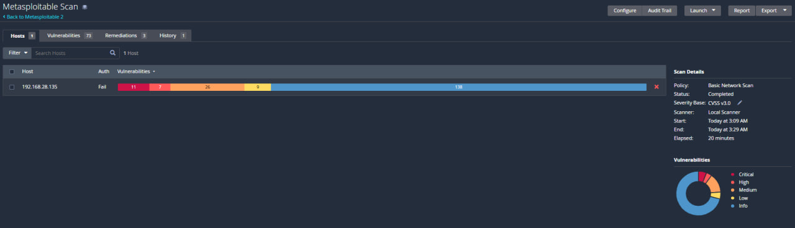
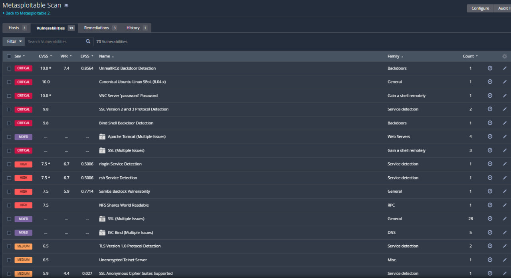
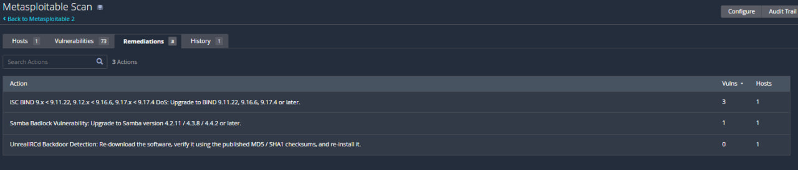

# 🛡️ Vulnerability Assessment – Metasploitable 2 (Nessus)

## 📌 Overview

This project demonstrates a **vulnerability assessment** conducted on the intentionally vulnerable system **Metasploitable 2** using the **Nessus vulnerability scanner**.

The objective of this assessment was to:
- Identify security vulnerabilities
- Analyze their impact
- Recommend remediation steps

---

## 🎯 Objectives

- Perform a vulnerability scan using Nessus  
- Identify critical and high-risk vulnerabilities  
- Analyze potential security impact  
- Provide remediation recommendations  

---

## 🧪 Lab Setup

| Component      | Details                  |
| :------------- | :----------------------- |
| **Scanner** | Nessus (Windows Host)       |
| **Target** | Metasploitable 2 VM          |
| **Network Type**| NAT                     |
| **Scan Type** | Basic Network Scan        |

---

## 🔍 Scan Summary

- Total Vulnerabilities: **73**
- Critical: Multiple
- High: Multiple
- Medium/Low/Info: Present

👉 The system is **highly vulnerable** and can be easily compromised.

---

## 🚨 Key Findings (Top 5)

### 1. UnrealIRCd Backdoor
- Allows remote command execution without authentication  
- Leads to full system compromise  

### 2. VNC Weak Password
- Default password “password” detected  
- Enables unauthorized remote access  

### 3. Bind Shell Backdoor
- Direct shell access available to attackers  
- Bypasses authentication mechanisms  

### 4. SSLv2/SSLv3 Enabled
- Outdated encryption protocols  
- Vulnerable to interception attacks  

### 5. Samba Badlock Vulnerability
- Allows man-in-the-middle attacks  
- Can compromise network communications  

---

## 🛠️ Remediation Summary

- Remove or patch backdoored services  
- Enforce strong authentication (password policies)  
- Disable insecure protocols (SSLv2/SSLv3)  
- Apply latest security updates  
- Restrict unnecessary services  

---

## 📸 Scan Evidence

> Screenshots of the Nessus scan results are included below:

### 🔹 Vulnerability Overview

### 🔹 Critical Vulnerabilities

### 🔹 Remediation Suggestions

---

## 📄 Full Report

👉 [Download Full Vulnerability Report](Metasploitable2_VulnScanReport.pdf)

---

## 🧠 Skills Demonstrated

- Vulnerability Scanning  
- Risk Analysis  
- CVSS Understanding  
- Security Reporting  
- Remediation Planning  

---

## ⚠️ Disclaimer

This project was conducted in a **controlled lab environment** using an intentionally vulnerable machine (**Metasploitable 2**) for educational purposes only.

---

## 🚀 Author

**Abbhilash Simanchalam**  
Cybersecurity Graduate | SOC Analyst Aspirant  
